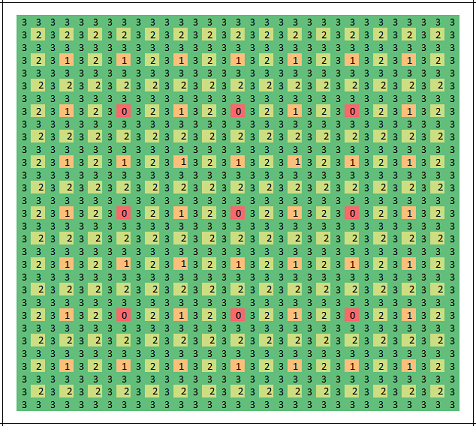
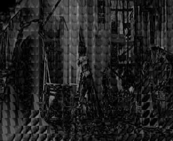
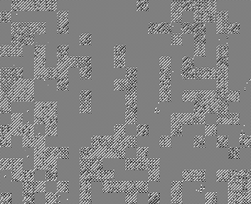
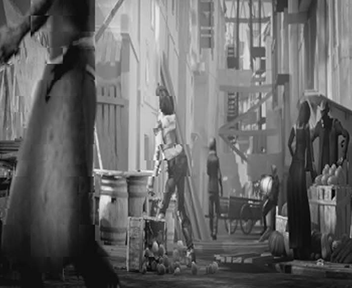
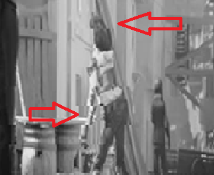

# [ImageEncoder](https://github.com/Wosser1sProductions/ImageEncoder) 
[TOC]

## Build

1. Install g++\-7 with the commands in install_g++.sh
2. Build the encoder with:
    `make encoder`
    
    Build the decoder with:
    `make decoder`
    
    Or build both with:
    `make` or `make all`
3. Got to the ./bin folder and run the encoder/decoder 
    with a file containing the settings.

## Info Image Encoder
- Linux builds (through Win10 bash) and Windows builds are provided in  `./bin`

- A QtCreator .qbs project file is included for debugging, the makefile will always build for release by default.

- Everything was implemented according to the assignment, i.e. nothing is excluded.

- One extra thing is an offset for each pixel before the DCT step (and after the iDCT), here the value of 128 is subtracted from the pixels (and added during decoding) to make the DCT components smaller and easier to fit in less space.

- The encoded image has the following structure:

    | Property                          | Amount of bits |
    |-----------------------------------|:--------------:|
    | Bit length for quant matrix coeff | `5` |
    | Quant matrix coeffs               | `16 * bit_len` |
    | Whether to use RLE                | `1` |
    | Image width                       | `15` |
    | Image height                      | `15` |
    | Block data                        | different for every block |
    | Bit length for data in block      | `5` |
    | Data length (if using RLE)        | `block bit_len` |

    For the example quant matrix in the assignment, the header is 20.5 bytes of data.

- The en/decoder will give a compression percentage after writing the resulting file. (`< 100.0`: result is smaller, `> 100.0`: result is bigger )

- The Block size is provided as a Template argument and can be changed in Block.hpp.
  Everything should work as expected, only an 8x8 quant matrix is needed to continue.
  However, resulting images do not seem as good in comparison with a 4x4 block size.

- A single example is provided (the image from the iPyhton notebooks) for convenience.
  Other testing images used during development can be added on request.

### Extra
- The encoder now has an additional step to apply Huffman encoding on the final bitstream. This will also be decompressed by the decoder, if set in the encoded image. The inclusion of Huffman encoding can be toggled through the `ENABLE_HUFFMAN` macro in `main.hpp` or through the makefile.

    When enabled, the first bit of the resulting stream will be set to `1`. The following structure will appear instead of the encoded image:

    | Property                          | Amount of bits |
    |-----------------------------------|:--------------:|
    | Huffman encoding used             | `1` |
    | Huffman table header group        | `12` |
    | **[HDR]** Has sequence            | `1 of 12` |
    | **[HDR]** Sequence length         | `7 of 12` |
    | **[HDR]** Amount of bits for vals | `4 of 12` |
    | Sequence entry {key:val}          | `(8 + val_bit_len) * seq_len` |
    | Huffman encoded data              | rest |

    The occurrences of every byte in the stream are counted, and a heap is constructed to build a tree from. This tree is then converted to a dictionary containing keys and the paths to follow in the tree.
    After creating the Huffman dictionary, the frequencies of each path length are determined.
    `{key: value}`-pairs are grouped by their path length. 

    A header contains `1` bit to indicate whether there is a sequence, 7 bits for the length of the sequence (= amount of `{key: value}`-pairs until the next header) and 4 bits for the amount of bits for each value in this group.
    Afterwards, every byte (size can be changed with template arguments, but using 8 bits limits the
    Huffman dictionary to a manageable 256 entries) is encoded according to the Huffman dictionary.

    If the addition of Huffman encoding results in a bigger image than the already encoded image, the Huffman dictionary will not be included and the original encoded stream will be restored.

- An elapsed time in milliseconds is now provided after en/decoding.

- A progress bar indicates how many blocks are already done.

- By including the `-DENABLE_OPENMP` compiler flag, the code will build with OpenMP enabled (set in `main.hpp` or in the makefile). This causes Block functions to run in parallel (where possible) and improves the en/decoding speed. This is however not supported with MSVC, since the loop uses iterators and support for iterators came in OpenMP 3.0 while MSVC only implements features up to version 2.0.

- Timings and [test results](#Test-Results) were added below.

- A [class diagram](#Class-diagram) giving an overview of the code was generated through Visual Studio.

- The git repo (title link) will be made public after presenting the video en/decoder for evaluation.

## Info Video Encoder

- The `Block<>` class was expanded with a second template specification:

  ```C++
  using MicroBlock = dc::Block<dc::BlockSize>;		// dc::BlockSize      =  4
  using MacroBlock = dc::Block<dc::MacroBlockSize>;	// dc::MacroBlockSize = 16
  ```
  Methods were added to process data at Macroblock level.

- The new `VideoEn-/Decoder` classes inherit from `VideoProcessor` (instead of ImageProcessor) that holds a list of Frame instances for the video.

- A frame is used to process Micro- or MacroBlocks according to the GOP setting. MacroBlock's get a reference to their previous frame and can request a new MacroBlock at an arbitrary pixel coordinate.
  For simplicity, these blocks cannot be chosen outside of a frame, their coordinates will be restricted to be within the frame boundaries.

- Motion vectors are estimated according to a fixed recursive pattern, as given by a pre-cached list of pixel offsets. These follow the same pattern as the 2D log search approach. The picture below indicates the considered points at each level: first the 9 points at level 0 are evaluated, then the best offset is chosen and the search window decreases by a factor 2. The pixels at level 1 around the chosen level 0 pixel will be compared, ... up to level 3. At this depth, no other pixels can be chosen and the level 3 pixel becomes the best value for the motion vector estimation. 
  With a merange of 16 as shown below, the border pixels will not be evaluated. The amount of motion vectors considered for each MacroBlock has an upper limit of 36. If no better match was found than the previous best, the search will have an early exit. This is obviously much better than the standard of 1089 considered points when just iteration over the entire block.

   

  The current scoring function uses Sum of Absolute Difference (SAD). After finding the best match, the actual difference will be expanded to the corresponding Microblocks that lay within the considered Macroblock.

- After all MacroBlocks have their motion vectors assigned, these vectors will be written to the outputstream, but only the relative offsets with the block coordinate, not the full (x, y) pixel coordinates. The already expanded Microblocks (that now contain the difference between the current frame and the corresponding blocks in the previous one) will be encoded as a normal image (or IFrame). The strength of the motion estimation algorithm lays in finding the motion estimate vectors and only encoding the relative difference with the match instead of only info in the current frame.

- No MacroBlocks are encoded as is (following the assignment). A motion vector is always found, because (0, 0) is included as start vector (same location, but in reference frame).

- Extra Huffman should work when compiled with the extra flag, I ran into some decoding problems on a test frame and have yet to find out what went wrong. OpenMP is not fully included, since it ran into problems as well (mostly due to time constraints).

## Examples

### Images

- Original image:

    

- The decoder had an "error" where signed encoded data was interpreted as unsigned, and
  consequently every pixel that would contain signed data was wrongly transformed during iDCT, giving these weird uniform areas:

    

- This was solved by providing a more specific function to check the minimal required bit length to represent a data value.

    e.g. The new function would check if a value could be encoded in x bits, by shifting the value to the left of an int16, and re-shifting it back (to create a signed value), if the result is the same as the original, the value can be encoded using x bits. If not, increase x until it does.
    This way the decoder could do the same thing, because it knows the bit length, and the original value is properly decoded (signed or unsigned).

    

### Video

- A couple of error were noticed after the encoder and decoder process was finally finished. This is one of the first frames I saw after running the en/decoder:

    

    Here the woman in the center is barely visible, and it seems that a lot of Macroblocks are similar, which is obviously not supposed to happen. After some digging it looked like there was no data passed to the error prediction frame, it was filled at random. After fixing this the following image appeared: 

    

    Now it was even worse. There was no actual image data left in the PFrame. I found that the expanded motion prediction errors where not taken into account when decoding a frame, and the effect of a motion vector where completely negated.

    I added a new function to copy the motion prediction error Macroblock data to its corresponding Microblocks (within the Macroblock). This resulted in an actually better looking image.

    

    However, certain Macroblocks seem to be completely off-target. Since nothing was wrong with the way I searched for them,  I looked elsewhere.
    I appeared I had used the bit size of the GOP parameter to store the motion vectors instead of the actual correct value of the merange parameter. In the above frame, all motion vectors would only be about 3 bits in size.

    

    After a quick correction, everything went as expected as seen above. Scene switches also appered smoothly as seen below.
    
    

Due to some time constraints (other overlapping deadlines), I only recently finished the video encoder, so not much else could be tested. I did however make two comparison videos with a randomly selected subject. On the left is the encoded and then decoded video with motion compensation enabled, and on the bottom-right the same video, but with the setting disabled. The artefacts are clearly visible on fast moving objects in each video.

| Link                                                     | GOP  | MERANGE |         Motion comp         |
| :------------------------------------------------------- | :--: | :-----: | :-------------------------: |
| [Example 1](https://www.youtube.com/watch?v=sTdJlQB5bEo) |  4   |   16    | 1/0 (top-left/bottom-right) |
| [Example 2](https://www.youtube.com/watch?v=3n3cSAYzSbc) |  6   |   32    | 1/0 (top-left/bottom-right) |

Both were encoded to YUV frames with ffmpeg, then encoded and decoded by my video en/decoder and then encoded back with the rawvideo coded on ultrafast to an mp4 with minimal loss in pixelation. The total encoding process took around one minute for 10 seconds of 1280x720@25fps video. I also added the audio from the original videos back before uploading the results.

I am not going to upload the 3.4 Gb ( * 2) of decoded videos (628 Mb encoded) as the assignments specifies, but I will keep them as reference if requested.

## Test results
### Size statistics

| Example image | Resolution     | Raw size   | Encoded    | Ratio | Huffman    | Ratio |
|---------------|:--------------:|-----------:|-----------:|------:|-----------:|------:|
| ex0           | `8x8`          |        64b |        82b |  128% |        82b |  128% |
| ex1           | `936x936`      |   876 096b |   413 210b |   47% |   327 658b |   37% |
| ex2           | `512x512`      |   262 144b |   104 597b |   40% |    83 274b |   32% |
| ex3           | `400x400`      |   160 000b |    76 033b |   48% |    61 230b |   38% |
| ex4           | `4096x912`     | 3 735 552b | 1 834 256b |   49% | 1 473 058b |   39% |
| ex5           | `2160x2160`    | 4 665 600b | 1 598 931b |   34% | 1 369 376b |   29% |
| ex6           | `512x256`      |   131 072b |    42 198b |   32% |    34 191b |   26% |

### Timing statistics

| Example image | Resolution     | Enc Time | Dec Time | Huffman enc | Huffman dec | OpenMP enc | OpenMP dec |
|---------------|:--------------:|---------:|---------:|------------:|------------:|-----------:|-----------:|
| ex0           | `8x8`          |    7.0ms |    5.1ms |       8.0ms |       5.5ms |     11.9ms |      5.6ms |
| ex1           | `936x936`      |  239.8ms |  201.1ms |     266.4ms |     220.2ms |    126.0ms |     79.5ms |
| ex2           | `512x512`      |   74.8ms |   65.6ms |      85.7ms |      67.9ms |     43.0ms |     29.0ms |
| ex3           | `400x400`      |   49.0ms |   42.0ms |      57.7ms |      45.6ms |     29.5ms |     20.6ms |
| ex4           | `4096x912`     | 1019.0ms |  842.1ms |    1139.5ms |    851.26ms |    461.9ms |    327.3ms |
| ex5           | `2160x2160`    | 1241.7ms | 1060.8ms |    1334.7ms |    1046.7ms |    506.1ms |    373.1ms |
| ex6           | `512x256`      |   38.5ms |   33.8ms |      46.2ms |      35.3ms |     23.9ms |     17.4ms |

*Regular*, *With extra Huffman compression* and *Huffman with OpenMP*. All were determined on a machine with an `Intel i7 7700k` CPU with the default turbo boost enabled (3.5 to 4.90 GHz clock speed).

No expansive video en/decoding statistics as of yet.

The given sample videos on Blockboard take between 3 and 4.5 seconds to encode and about 85% of that to decode, resulting in a compression between 11 (the moving blocks) and 27%.

The two example videos above (1280x720@25fps) yielded the following data:

| Example video      | Resolution     | Enc Time | Dec Time | Raw size | Enc size |
|--------------------|:--------------:|---------:|---------:|--------------------|--------------------|
| 10 second segments | 1280x720@25fps |     ~60s |     ~48s |345 600 000b|62 860 230b|

Or a total raw size of  3 456 000 000b and encoded size of 628 602 300b, about 18% of the original.
Mind that in these results,  Huffman was not enabled, since it crashed the decoder on certain frames (I haven't found out where yet).

## Class diagram 


